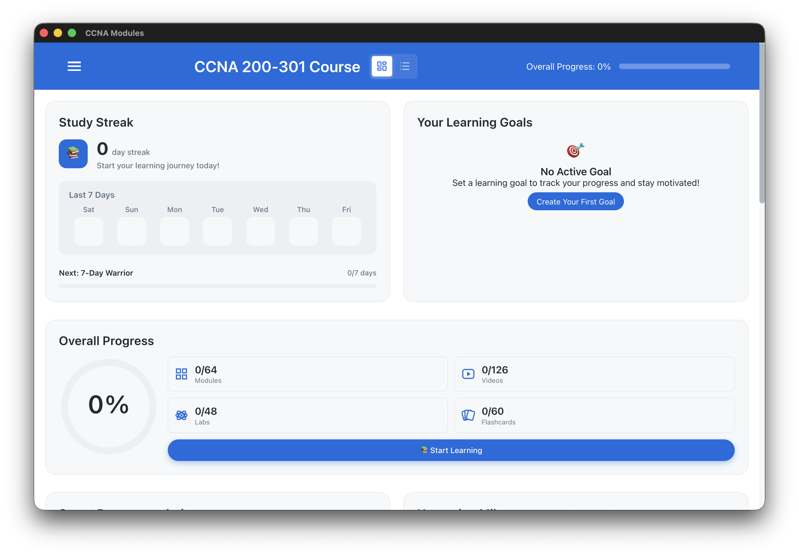
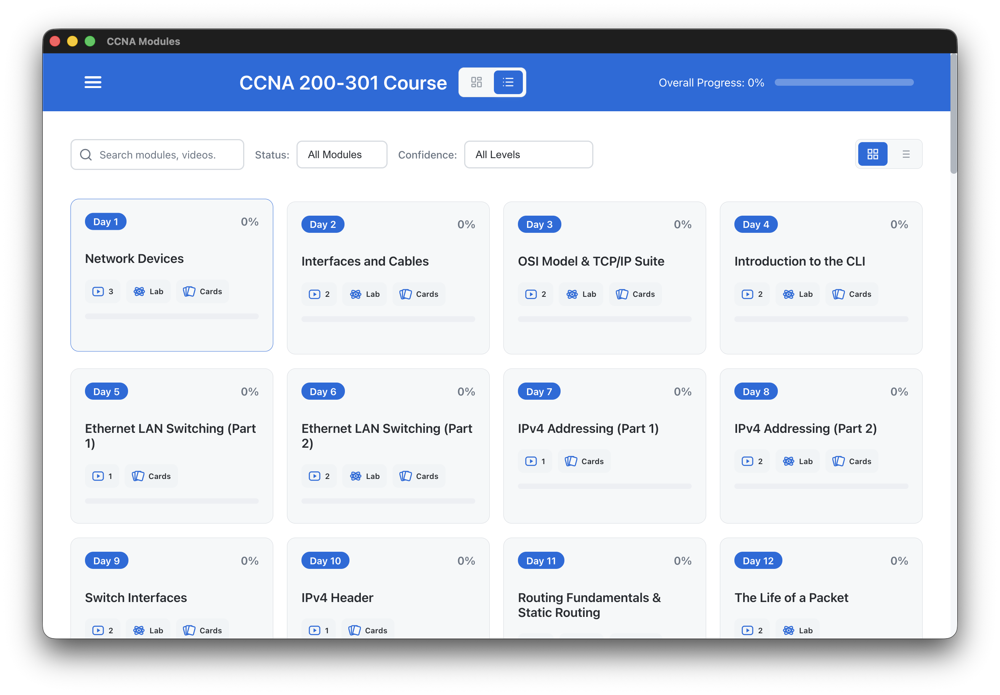
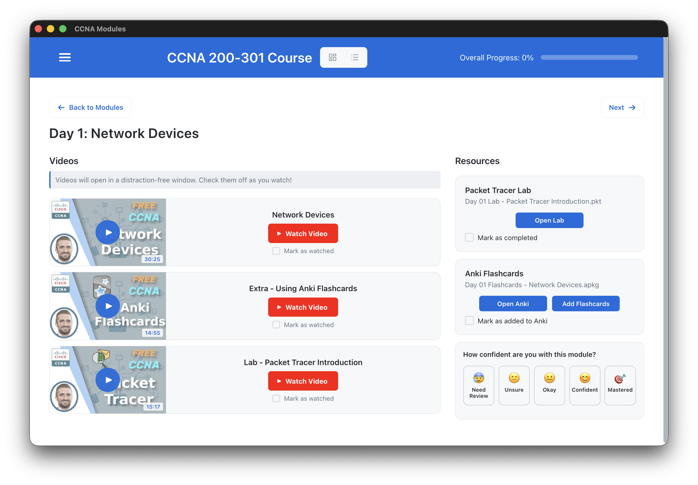

# CCNA Modules Desktop Application

[](LICENSE)
[]()
[]()
[]()
[]()

A desktop application for organizing and tracking progress through Jeremy's IT Lab CCNA 200-301 course content.

## Overview

This Electron-based desktop application provides a structured interface for:

- Accessing all 63 days of CCNA course modules
- Watching course videos on YouTube
- Opening Packet Tracer lab files
- Managing Anki flashcard decks
- Tracking learning progress

## Screenshots

### Dashboard


_Main dashboard showing overall progress, study streak, performance charts, and smart recommendations_

### Module List


_Browse and search all 63 CCNA modules with filters for completion status and confidence level_

### Module Detail


_View module content including videos, Packet Tracer labs, Anki flashcards, and rate your confidence_

### Theme Selection


_Choose from 14 beautiful color themes including Nord, Catppuccin, Ayu, Rose Pine, and more_

## Features

✅ **63 Complete Modules** - All days of the CCNA course
✅ **Video Integration** - Direct links to YouTube course videos
✅ **Lab Management** - Opens downloaded .pkt files in Packet Tracer
✅ **Flashcard Support** - Opens downloaded .apkg files in Anki
✅ **Progress Tracking** - Local storage-based completion tracking
✅ **Search & Filter** - Find modules quickly with advanced filtering
✅ **Study Streak** - Track daily study habits with visual calendar
✅ **Performance Analytics** - Charts and insights on your learning progress
✅ **Smart Recommendations** - AI-powered suggestions for what to study next
✅ **Confidence Ratings** - Rate your understanding of each module (1-5 stars)
✅ **14 Themes** - Customizable color schemes (Nord, Catppuccin, Ayu, Rose Pine, Gruvbox, and more)
✅ **Offline-Ready** - Track progress locally (videos require internet)
⚠️ **Resources Required** - Download labs & flashcards from Jeremy's IT Lab (free with email signup)
✅ **Cross-Platform** - Builds for macOS, Windows, and Linux

## Tech Stack

- **Electron 39** - Desktop application framework
- **React 19** - UI framework with new createRoot API
- **Tailwind CSS 4.1** - Utility-first CSS framework
- **shadcn/ui** - Pre-built accessible React components
- **Webpack 5** - Module bundler
- **electron-builder** - Application packaging
- **ESLint + Prettier** - Code quality and formatting
- **LocalStorage** - Progress persistence

## Installation & Setup

### For End Users

Download the latest release for your platform from the [Releases](../../releases) page.

## Getting Started

### 1. Download Resources

Sign up for Jeremy's IT Lab email list to get free access to:

- **Packet Tracer Labs** - 59 hands-on lab files (.pkt)
- **Anki Flashcards** - 97 flashcard decks (.apkg)

_These materials are © Jeremy's IT Lab and provided for educational use_

### 2. Configure Resource Path

1. Launch the app
2. Go to **Settings → Resources Path**
3. Select the folder where you downloaded the labs/flashcards
4. Start learning!

### For Developers

#### Prerequisites

- Node.js 18+ and npm
- Git

#### Installation

```bash
# Clone the repository
git clone <repository-url>
cd CCNA-Modules

# Install dependencies
npm install

# Build the React app
npm run build

# Start the application
npm start
```

#### Development Mode

```bash
# Run webpack dev server (for React development)
npm run dev

# In another terminal, start Electron
npm start
```

### Production Build

```bash
# Build for current platform
npm run dist

# Build for specific platforms
npm run dist:mac    # macOS (DMG + ZIP)
npm run dist:win    # Windows (NSIS + Portable)
npm run dist:linux  # Linux (AppImage + deb)
```

See [BUILD_NOTES.md](BUILD_NOTES.md) for detailed build information.

## Project Structure

```
CCNA-Modules/
├── src/
│   ├── components/        # React components
│   ├── data/
│   │   └── modules.js     # All 63 modules data
│   ├── utils/             # Utility functions
│   ├── styles/            # Global CSS files
│   ├── App.js             # Main React app
│   └── index.js           # React entry point
├── public/
│   └── index.html
├── resources/             # Lab and flashcard files (156 files: 59 labs + 97 flashcards)
├── build/                 # Build assets (icons)
├── main.js               # Electron main process
├── preload.js            # Electron preload script
├── webpack.config.js     # Webpack configuration
├── package.json
└── dist/                 # Webpack build output
```

## Available Scripts

### Development

```bash
npm run dev          # Start webpack dev server
npm start           # Launch Electron app
npm run build       # Build React app with webpack
```

### Production Building

```bash
npm run dist        # Build for current platform
npm run dist:mac    # Build for macOS (DMG + ZIP)
npm run dist:win    # Build for Windows (NSIS + Portable)
npm run dist:linux  # Build for Linux (AppImage + deb)
```

### Code Quality

```bash
npm run lint        # Run ESLint
npm run lint:fix    # Fix ESLint errors
npm run format      # Format with Prettier
npm run format:check # Check formatting
```

## User Prerequisites

To use all features, users need:

1. **Cisco Packet Tracer** - For opening .pkt lab files
2. **Anki** - For importing .apkg flashcard decks
3. **Internet connection** - For watching YouTube videos

## Key Technical Decisions

### Video Playback

Videos open in a new window.

### Resource Handling

- **Development**: Resources loaded from `./resources/` directory
- **Production**: Resources bundled using electron-builder's `extraResources`
- Access via `process.resourcesPath` in packaged apps

### Progress Tracking

Uses localStorage for offline-capable progress tracking:

- Video completion status
- Lab completion status
- Flashcard import status
- Module confidence ratings (1-5 stars)
- Study streak and activity history
- Performance snapshots over time
- Module and overall progress percentages

### Security

- CSP (Content Security Policy) configured
- webSecurity enabled
- No remote code execution
- YouTube thumbnails allowed for preview images

## Module Data Structure

Each module in `src/data/modules.js`:

```javascript
{
  id: 1,
  day: 1,
  title: 'Network Devices',
  videos: [
    { id: 'H8W9oMNSuwo', title: 'Network Devices', duration: '17:06' }
  ],
  resources: {
    lab: 'Day 01 Lab - Packet Tracer Introduction.pkt',
    flashcards: 'Day 01 Flashcards - Network Devices.apkg'
  }
}
```

## Known Limitations

1. **Code Signing**: App is not code signed
   - macOS users must right-click → Open on first launch
   - Windows users may see SmartScreen warnings

2. **Icon**: Uses default Electron icon
   - Custom icons can be added to `build/` directory

3. **Video Progress**: Cannot resume videos from last position
   - Requires YouTube API access and authentication (not implemented)
   - Videos open in external browser window

## Future Enhancements

- [ ] Add custom application icons
- [ ] Code signing certificates for trusted distribution
- [ ] Study timer with session tracking
- [ ] Notes feature for each module
- [ ] Quiz mode & self-assessment
- [ ] Keyboard shortcuts
- [ ] Cloud backup & sync
- [x] Search/filter functionality - ✅ Implemented
- [x] Theme customization - ✅ 14 themes available
- [x] Confidence ratings - ✅ Implemented
- [x] Study streak tracking - ✅ Implemented
- [x] Performance analytics - ✅ Implemented
- [x] Smart recommendations - ✅ Implemented

## Theme Credits

This application includes 14 customizable color themes inspired by popular developer color schemes:

- **[Nord](https://www.nordtheme.com)** - Arctic-inspired north-bluish color palette
- **[Catppuccin](https://catppuccin.com)** - Soothing pastel theme with rich, warm colors
- **[Ayu](https://github.com/ayu-theme/ayu-colors)** - Clean, bright syntax highlighting colors
- **[Rose Pine](https://rosepinetheme.com)** - Muted purple-brown theme with natural elegance
- **[Gruvbox](https://github.com/morhetz/gruvbox)** - Warm, retro groove colors for daytime coding
- **[Spacegray](https://github.com/kkga/spacegray)** - Hyperminimal dark theme collection
- **Dark/Light** - Classic default themes
- **Ocean/Neon** - Custom themes for the app

## Credits

- **Course Content**: Jeremy's IT Lab CCNA 200-301 Course
- **YouTube Channel**: https://www.youtube.com/@JeremysITLab
- **Application**: Built as a learning organization tool

## License

MIT License

Course materials and videos are © Jeremy's IT Lab.

## Support

For application issues, please open an [issue](../../issues).

For course content questions, visit [Jeremy's IT Lab YouTube channel](https://www.youtube.com/@JeremysITLab).

## Changelog

### Version 1.0.0

- Initial release
- 63 complete modules with all video IDs
- 59 Packet Tracer labs + 97 Anki flashcard decks
- Progress tracking with localStorage
- Search and filter functionality
- 14 customizable color themes
- Study streak tracking with calendar
- Performance analytics and charts
- Smart study recommendations
- Confidence rating system (1-5 stars)
- Cross-platform build configuration (macOS, Windows, Linux)
